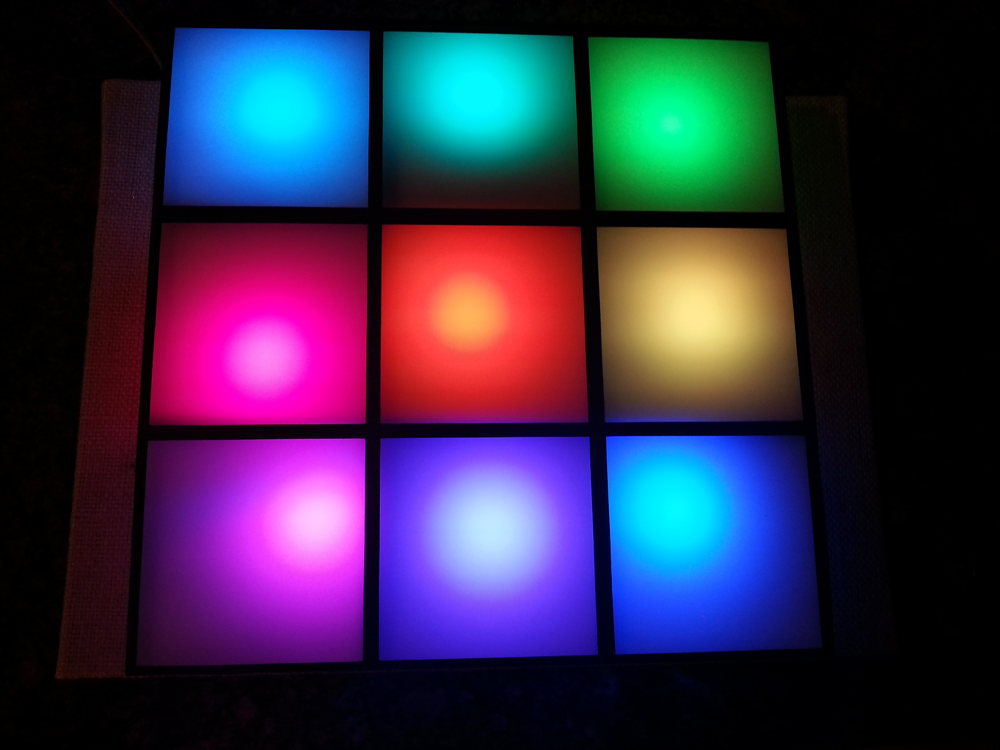

This is a 3x3 light squares with a tilt-a-whirl.  The intent of this project was just to have a bit of fun and keep myself occupied while the family watched the 2014 November soccer game.  

This build is a 3x3 pixel grid with some really nice colors.  I used the orientation of the entire installation to decide the specific state of the project.  If you flip the project onto its sides then the tilt-a-whirl will choose a new state.

I saw a project on my feed that showed color squares.  It looked pretty neat and I decided to try my own version of the same project.  Products used:

* The light source: 9 Neopixels - https://www.adafruit.com/products/1461.  Cost: $3.75
* The breadboard: Solderable mini breadboard - https://www.sparkfun.com/products/12702.  Cost: $2.95
* Main processor: Arduino Pro mini - https://www.sparkfun.com/products/11113.  Cost: $9.95
* Input: Tilt-A-Whirl - https://www.sparkfun.com/products/12011.  Cost: $5.95

I would have used an AT Tiny, in the form of an Adafruit Trinket or similar, since it is cheaper, but this project required the 32k memory of the full Atmega328 primarily because I wanted to code in some fun color sequences.

I was also going to go with buttons, then with a capacitive touch sensor, but I love the fun action of taking the box and flipping the orientation end-over-end as a way of specifying which program to run.  One side up is "off" and the other three sides are different light sequences that I really enjoyed. 

Including here the enclosure that I used for both the lights as well as the electronics. 
